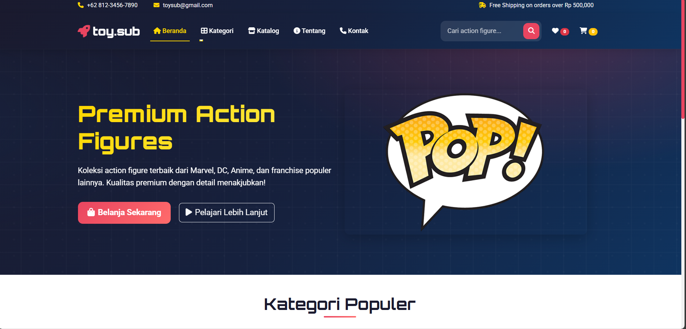
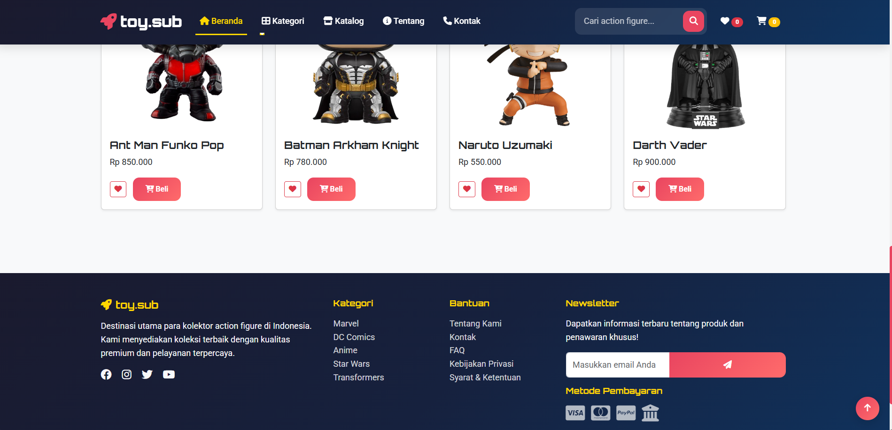
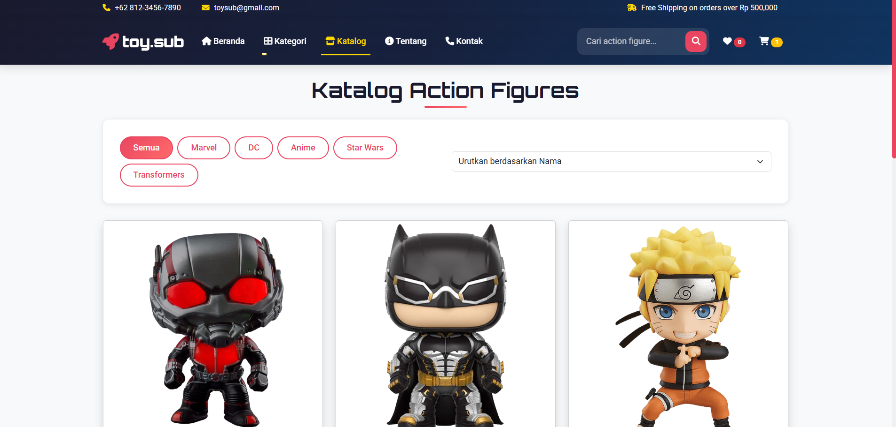
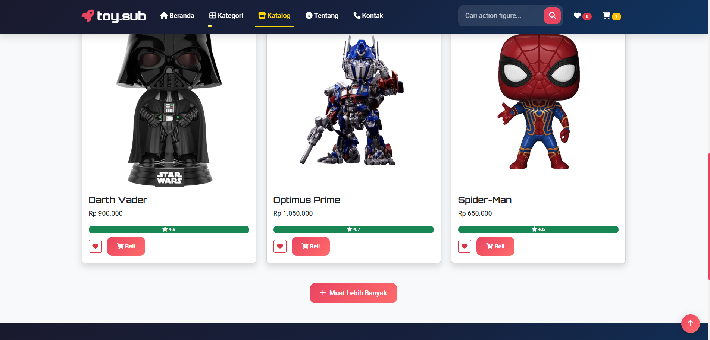
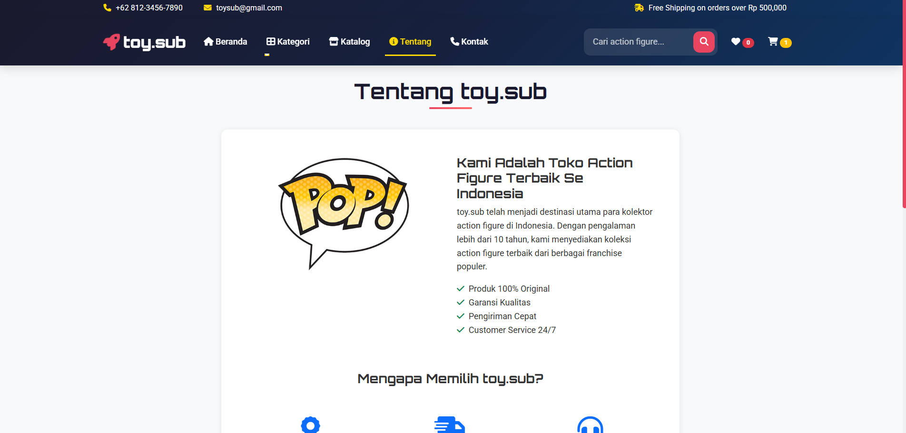
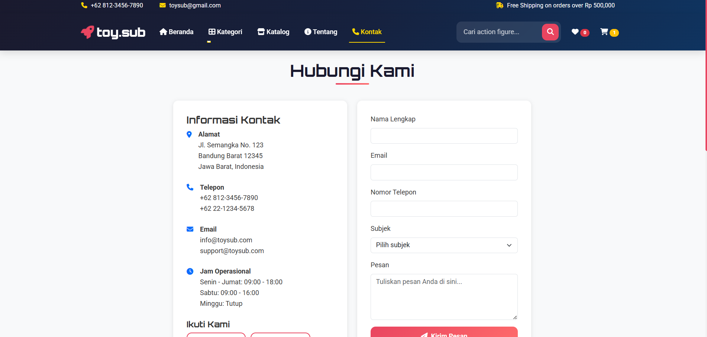
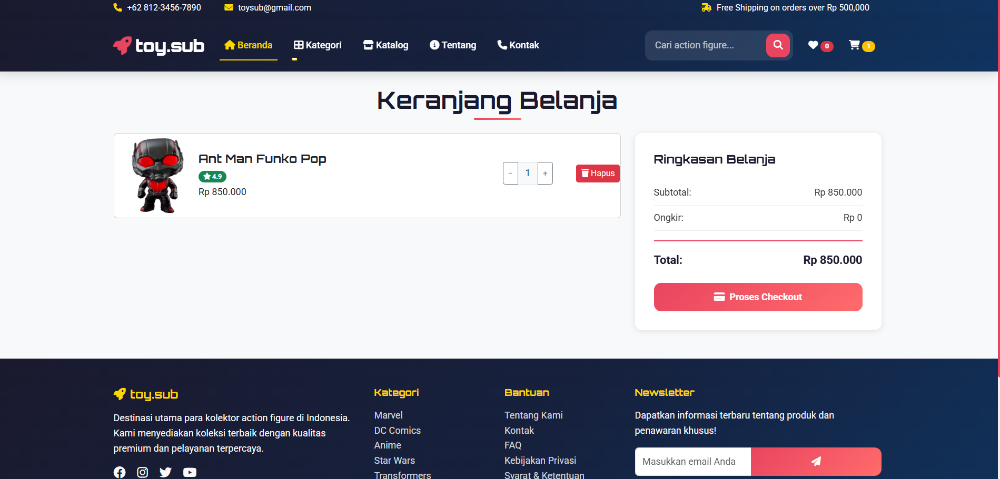
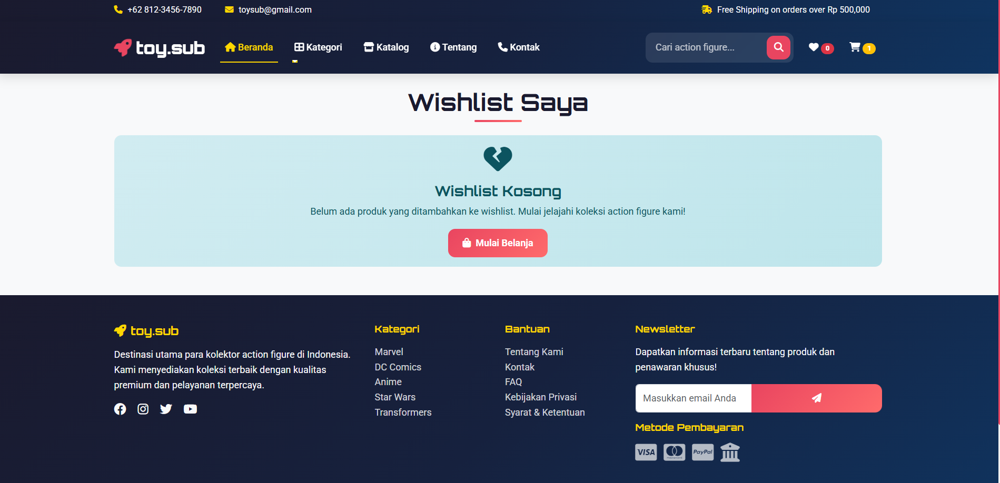

🏠 1. Beranda (Home)

Menampilkan halaman utama dengan hero section yang memperkenalkan toko dan produk unggulan.

Dilengkapi dengan gambar promosi, slogan “Premium Action Figures”, dan tombol Belanja Sekarang serta Pelajari Lebih Lanjut.

Memberikan kesan pertama yang kuat dengan tampilan profesional dan informatif.

🧩 2. Kategori (Category)

Menyediakan dropdown menu berisi berbagai kategori action figure:

🔴 Marvel

🟡 DC Comics

🔵 Anime

⚫ Star Wars

🟣 Transformers

⚪ Semua Produk

Setiap kategori akan menampilkan produk sesuai tema yang dipilih.

Memudahkan pengunjung mencari action figure berdasarkan franchise favorit mereka.

🛍️ 3. Katalog (Catalog)

Berisi daftar lengkap produk action figure yang tersedia di toko.

Dilengkapi fitur:

🔍 Filter kategori untuk menampilkan jenis produk tertentu.

↕️ Sortir produk berdasarkan nama, harga, atau rating.

🔄 Tombol “Muat Lebih Banyak” untuk melihat lebih banyak produk.

Cocok bagi pengguna yang ingin melihat semua koleksi secara menyeluruh.

ℹ️ 4. Tentang (About)

Menjelaskan profil dan sejarah toko toy.sub.

Menyampaikan visi, misi, dan keunggulan seperti produk original, pengiriman cepat, dan layanan 24/7.

Dilengkapi gambar dan ikon ilustratif untuk memperkuat identitas merek.

📞 5. Kontak (Contact)

Menyediakan informasi lengkap toko, meliputi:

Alamat toko

Nomor telepon dan email

Jam operasional

Terdapat formulir kontak agar pelanggan dapat mengirim pesan, pertanyaan, atau keluhan secara langsung.

Menampilkan notifikasi sukses setelah pesan terkirim.

❤️ 6. Wishlist

Menampilkan daftar produk yang disimpan oleh pengguna untuk dilihat atau dibeli nanti.

Bila kosong, muncul pesan interaktif untuk mengajak pengguna mulai berbelanja.

Memudahkan pelanggan mengorganisir produk favorit mereka.

🛒 7. Keranjang (Cart)

Berisi produk yang telah ditambahkan untuk pembelian.

Menampilkan rincian seperti nama produk, harga, jumlah, dan total belanja.

Dilengkapi fitur hapus produk, ringkasan subtotal, ongkos kirim, dan total keseluruhan.

Terdapat tombol “Proses Checkout” untuk melanjutkan ke tahap pembayaran.

⚙️ 8. Fitur Tambahan

🔝 Back to Top Button – tombol cepat untuk kembali ke bagian atas halaman.

💌 Newsletter – formulir berlangganan untuk mendapatkan update produk dan promo.

💳 Metode Pembayaran – menampilkan ikon berbagai metode pembayaran (Visa, MasterCard, PayPal, Bank).

🌐 Social Media Links – tautan ke akun media sosial resmi toy.sub (Facebook, Instagram, Twitter, YouTube).

## ScreenShot
|  |  |  |
|------------------------------------------|------------------------------------------|------------------------------------------|
|  |  |  |
|  |  |